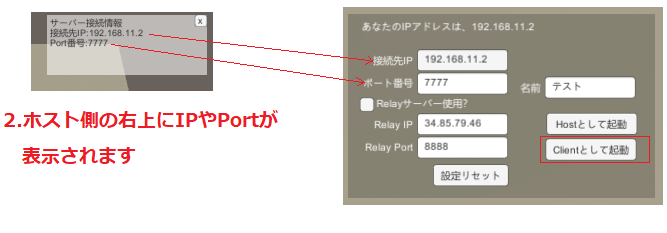
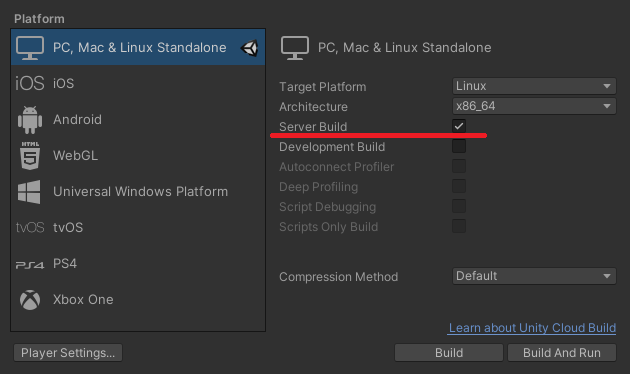

# NetcodeForGameObjects_UnitychanSample
This is a Unity-Chan sample for Netcode for GameObjects.
The compatible Unity version is Unity 6.
[日本語はコチラ](README.ja.md)

# ScreenShot

# Flow to connect
There are three main connection ways.  
These are: connecting directly via a local network, connecting via a relay server, and connecting via a headless server.  

## When connecting via a local network
1. Someone starts up the program as the host.  
2. When you start up as the host, the host's IP address and port number will be displayed in the top right-hand corner of the screen.  
3. The person who is going to connect as a client enters the ‘IP address and port number of the connection destination’ and presses ‘Start as a client’.  

  
(Please uncheck the ‘Use Relay Server’.)

## Connecting via Relay server

If you want to connect in this way, you will need to use Unity's Relay service.  
 
You will need to link your Unity project to the cloud service and build it with Relay turned on in the dashboard.

1. Start as a host with the ‘Use Relay Server’ box checked 
2. Once you have started as a host, the code for joining will be displayed in the top right-hand corner of the screen. 
3. If you are connecting as a client, enter the host's code into the RelayCode box with the ‘Use Relay Server’checkedd.

  

## Connecting using a headless server

To connect using this method, you will need the Server Build file.  
  
Please build using ‘Windows Server’, ‘Linux Server’ or ‘MacOS Server’ in the Build Profile.

1. Enter the server's IP address and port number, and press ‘Start as Client’ to run.

# How to use
Move with the cursor keys and press 1-5 on the keyboard to play the voice.  
A virtual pad is implemented for smartphones, so you can use it with the build for smartphones.  

# About the dummy client mode
Define ‘ENABLE_AUTO_CLIENT’should be enabled from ProjectSettings.  

When it is started in batch mode, such as ‘Sample.exe -batchmode’, it will operate as a dummy client.  
It will read the connectInfo.json file in the same directory as the executable file and connect using the settings in that file. If you want to change the connection destination, etc., please edit this file directly and start it.  