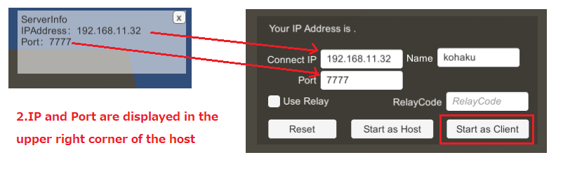
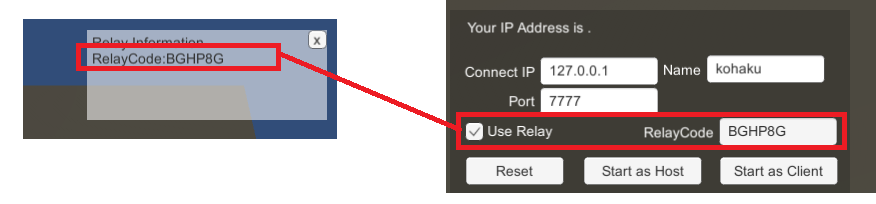

# NetcodeForGameObjects_UnitychanSample
This is a Unity-Chan sample for Netcode for GameObjects.
The compatible Unity version is Unity 6.<br />
[日本語はコチラ](README.ja.md)


# ScreenShot


# Flow to connect
There are three main connection ways. <br />
These are: connecting directly via a local network, connecting via a relay server, and connecting via a headless server. <br />


## When connecting via a local network
1. Someone starts up the program as the host. <br />
2. When you start up as the host, the host's IP address and port number will be displayed in the top right-hand corner of the screen. <br />
3. The person who is going to connect as a client enters the ‘IP address and port number of the connection destination’ and presses ‘Start as a client’. <br />

 <br />
(Please uncheck the ‘Use Relay Server’.)

## Connecting via Relay server

If you want to connect in this way, you will need to use Unity's Relay service. <br />
<br />
You will need to link your Unity project to the cloud service and build it with Relay turned on in the dashboard.

1. Start as a host with the ‘Use Relay Server’ box checked<br />
2. Once you have started as a host, the code for joining will be displayed in the top right-hand corner of the screen.<br />
3. If you are connecting as a client, enter the host's code into the RelayCode box with the ‘Use Relay Server’checkedd.


 <br />

## Connecting using a headless server

To connect using this method, you will need the Server Build file. <br />
 <br />
Please build using ‘Windows Server’, ‘Linux Server’ or ‘MacOS Server’ in the Build Profile.

1. Enter the server's IP address and port number, and press ‘Start as Client’ to run.

# How to use
Move with the cursor keys and press 1-5 on the keyboard to play the voice. <br />
A virtual pad is implemented for smartphones, so you can use it with the build for smartphones. <br />

# About the dummy client mode
Define ‘ENABLE_AUTO_CLIENT’should be enabled from ProjectSettings. <br />

When it is started in batch mode, such as ‘Sample.exe -batchmode’, it will operate as a dummy client. <br />
It will read the connectInfo.json file in the same directory as the executable file and connect using the settings in that file. If you want to change the connection destination, etc., please edit this file directly and start it. <br />

# QuickStart to learn this project.
We will explain the basics of Netcode and how to use it in this sample project.

## How to connect directly to the network, rather than using a relay
Set up the NetworkManager class as follows.

 <br />
NetworkManager manages the network.
UnityTransport, which is set in NetworkManager, actually performs the communication.

### Starting as a Host
A Host is a situation where both the server and the client are handled by a single process. <br />
The server that controls the game progress and the client that plays the game run at the same time. <br />

In the Host, you set things like which port to start the server on and what IP address to accept connections from in UnityTransport.
The code looks like this.
```
// Get the transport from the NetworkManager.
var transport = Unity.Netcode.NetworkManager.Singleton.NetworkConfig.NetworkTransport;
var unityTransport = transport as UnityTransport;

// Set up which IP address to use and wait on port 7777
unityTransport.SetConnectionData( IPAddress.Any.ToString() , (ushort)7777 );
```

Once the settings are complete, start it up as a host.
```
Unity.Netcode.NetworkManager.Singleton.StartHost();
```
Calling this will start it up as a host. <br />


### Starting as a Client
When starting as a client, you need to specify the destination and port. <br />
You can also set this from UnityTransport. <br />
The code will look something like this.

```
// Get the transport from NetworkManager.
var transport = Unity.Netcode.NetworkManager.Singleton.NetworkConfig.NetworkTransport;
var unityTransport = transport as UnityTransport;

// Connect to port 7777 on IP address 192.168.11.32.
unityTransport.SetConnectionData( ‘192.168.11.32’ , (ushort)7777 );
```

Once the settings are complete, start it up as a Client
```
Unity.Netcode.NetworkManager.Singleton.StartClient();
```
.


## Register the prefabs you want to synchronise over the network in the NetworkPrefabList

First, register the prefabs you want to synchronise over the network in the NetworkPrefabList, as shown in the image below.<br />

 <br />

### NetworkObject component
You need to attach a NetworkObjectComponent to the prefabs you want to synchronise. <br />
 <br />


### Classes that inherit from NetworkBehaviour
Components that contain information you want to synchronise must also inherit from NetworkBehaviour.
This allows you to use the functions of NetworkVariable, a variable that synchronises over the network, and RPC, a function that is executed at the connection destination.

## Spawning Objects on the Network
You can create objects on the network by instantiating a Prefab and then spawning a NetworkObject.
In this sample, each client spawns a character as the owner.
This is achieved using the following code.
```
var gmo = GameObject.Instantiate(prefab, randomPosition, Quaternion.identity);
var netObject = gmo.GetComponent<NetworkObject>();
netObject.SpawnWithOwnership(clientId);
```

## Synchronisation in this sample

In this sample, only the CharacterMoveController and ClientNetworkTransform components are used for network synchronisation.

### Transform Synchronisation
The NetworkTransform provided as standard in Unity uses the server-side coordinates as the correct values. <br />
As a result, you cannot perform coordinate operations on the client side, and the server side updates the coordinates. <br />
If there is a delay in communication, it will be difficult to move the character on the client side comfortably. <br />

For this reason, we use a ClientNetworkTransform with the following processing in order to take the form of direct manipulation by the user at hand, rather than the server.

```
public class ClientNetworkTransform : NetworkTransform{
protected override bool OnIsServerAuthoritative(){
return false;
}
}
```

### Synchronisation using NetworkVariable
In this app, we use a NetworkVariable to synchronise the Speed variable that is sent to the Animator and the player name.

The object is assumed to be operated by the owner, so it is declared as follows.
```
private NetworkVariable<Unity.Collections.FixedString64Bytes> playerName = 
new NetworkVariable<Unity.Collections.FixedString64Bytes>(‘’,NetworkVariableReadPermission.Everyone,NetworkVariableWritePermission.Owner);

```

And, by doing the following, it is set up so that only the owner can update it. (IsOwner is a property on the NetworkBehaviour side.)
```
private void Start(){
if (IsOwner){
this.playerName.Value = ConfigureConnectionBehaviour.playerName;
}
}
```

### Processing using RPC
RPC stands for Remote Procedure Call, and refers to remote function calls.
In this sample, it is used to play audio when the 1-5 keys are pressed.

The declaration method is very easy, and you add the [Rpc] attribute as follows. <br />
Then, when you call it, you pass who you want to execute it as an argument. Here, we want everyone to execute it, so we use ‘SendTo.Everyone’.
```
[Rpc(SendTo.Everyone)]
private void PlayAudioRpc(int idx) { 
this.audioSouceComponent.Play();
}
```

And by doing the following, PlayAudioRpc is executed on all clients.
```
if(IsOwner){
PlayAudioRpc(0);
}
```
